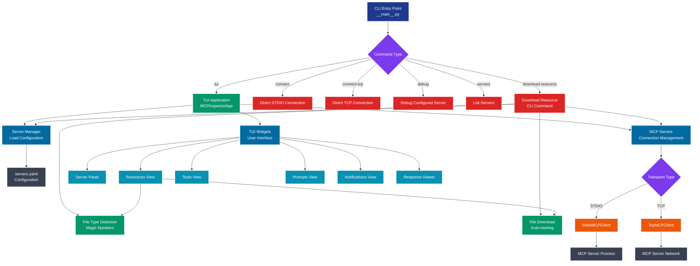
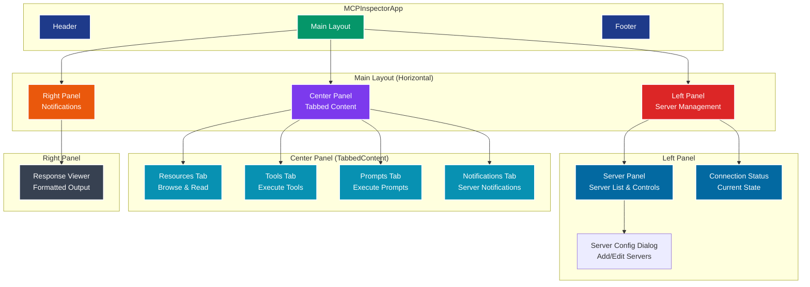
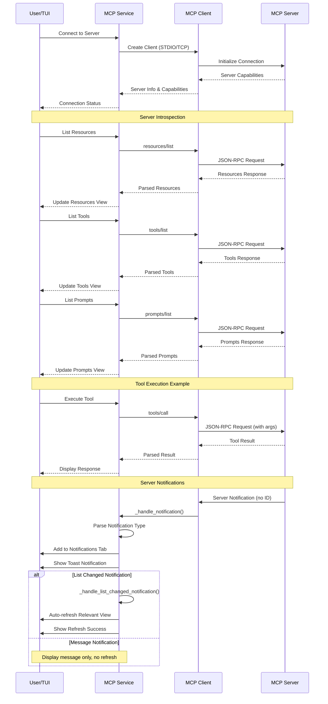
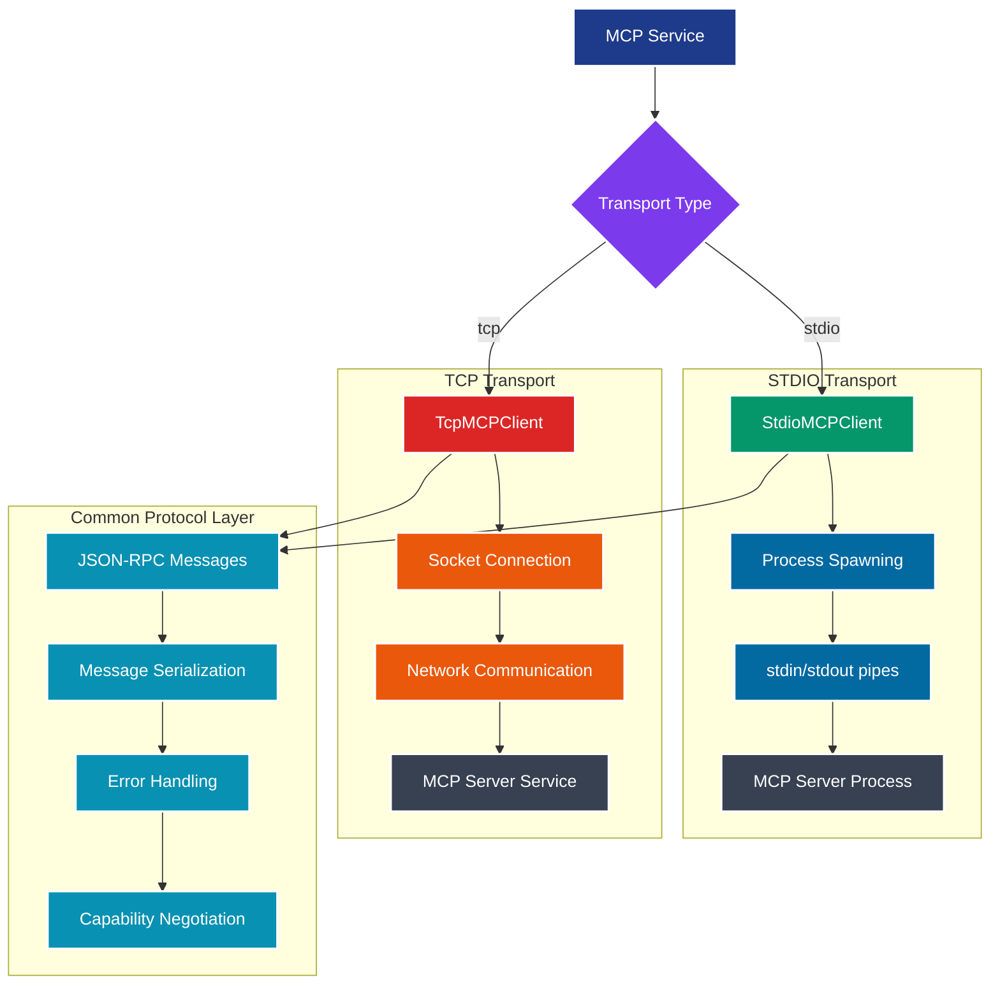
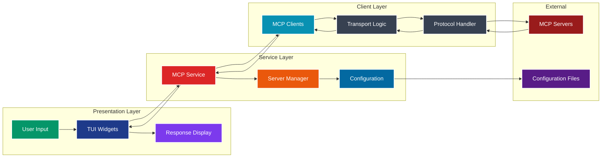
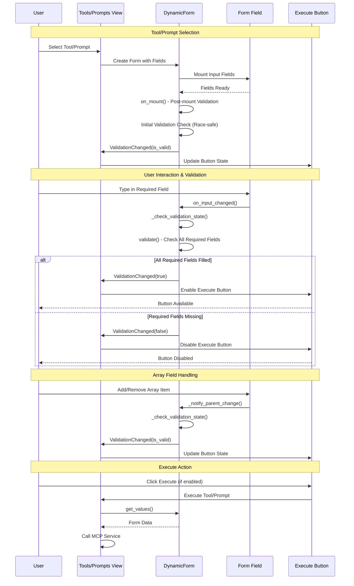

# PAR MCP Inspector TUI - Architecture Diagrams

This document contains the architectural diagrams for the PAR MCP Inspector TUI project.

## Application Flow Diagram

Displays how CLI commands route to different parts of the application, from entry point through services to external MCP servers.



## TUI Component Architecture

Displays the layout structure of the TUI application with all panels and widgets.



## MCP Protocol Flow

Sequence diagram displaying the communication flow between user, service, client, and MCP server during connection and operations.



## Client Transport Architecture

Displays the two transport types (STDIO/TCP) and their connection to the common protocol layer.



## Data Flow Through Layers

Displays how data flows between the presentation, service, client, and external layers.



## Color Legend

The diagrams use a consistent color scheme optimized for dark mode:

- **Navy Blue** (`#1e3a8a`) - Primary application components
- **Green** (`#059669`) - Main flow and success states  
- **Red** (`#dc2626`) - CLI commands and critical paths
- **Purple** (`#7c3aed`) - Decision points and branching logic
- **Orange** (`#ea580c`) - Transport and communication layers
- **Cyan** (`#0891b2`) - UI components and widgets
- **Gray** (`#374151`) - External systems and files
- **Dark Red** (`#991b1b`) - External servers
- **Dark Purple** (`#581c87`) - Configuration files

All elements feature white text (`#ffffff`) and white borders for maximum contrast and readability in both light and dark mode environments.

## Form Validation Flow

Displays the reactive form validation system that controls execute button states in Tools and Prompts views.



## Dynamic Form Architecture

Displays the structure and relationships within the form validation system.

```mermaid
flowchart TD
    subgraph "Form Validation System"
        A[DynamicForm Widget]
        B[ValidationChanged Message]
        C[Form Fields Collection]
    end

    subgraph "Field Types"
        D[Input Fields<br/>Text/Number]
        E[Select Fields<br/>Dropdown]
        F[Checkbox Fields<br/>Boolean]
        G[ArrayField Widget<br/>Dynamic List]
    end

    subgraph "Validation Logic"
        H[validate() Method<br/>Check Required Fields]
        I[is_valid() Method<br/>No Errors Check]
        J[_check_validation_state()<br/>State Change Detection]
    end

    subgraph "Event Handling"
        K[on_input_changed()]
        L[on_select_changed()]
        M[on_checkbox_changed()]
        N[Array Item Changes]
    end

    subgraph "Parent Views"
        O[ToolsView<br/>Execute Tool Button]
        P[PromptsView<br/>Execute Prompt Button]
    end

    A --> C
    C --> D
    C --> E
    C --> F
    C --> G

    D --> K
    E --> L
    F --> M
    G --> N

    K --> J
    L --> J
    M --> J
    N --> J

    J --> H
    H --> I
    I --> B

    B --> O
    B --> P

    O --> Q[Button State Update]
    P --> Q

    style A fill:#1e3a8a,stroke:#ffffff,stroke-width:2px,color:#ffffff
    style B fill:#7c3aed,stroke:#ffffff,stroke-width:2px,color:#ffffff
    style C fill:#059669,stroke:#ffffff,stroke-width:2px,color:#ffffff
    style D fill:#0891b2,stroke:#ffffff,stroke-width:2px,color:#ffffff
    style E fill:#0891b2,stroke:#ffffff,stroke-width:2px,color:#ffffff
    style F fill:#0891b2,stroke:#ffffff,stroke-width:2px,color:#ffffff
    style G fill:#ea580c,stroke:#ffffff,stroke-width:2px,color:#ffffff
    style H fill:#dc2626,stroke:#ffffff,stroke-width:2px,color:#ffffff
    style I fill:#dc2626,stroke:#ffffff,stroke-width:2px,color:#ffffff
    style J fill:#dc2626,stroke:#ffffff,stroke-width:2px,color:#ffffff
    style K fill:#0369a1,stroke:#ffffff,stroke-width:2px,color:#ffffff
    style L fill:#0369a1,stroke:#ffffff,stroke-width:2px,color:#ffffff
    style M fill:#0369a1,stroke:#ffffff,stroke-width:2px,color:#ffffff
    style N fill:#0369a1,stroke:#ffffff,stroke-width:2px,color:#ffffff
    style O fill:#374151,stroke:#ffffff,stroke-width:2px,color:#ffffff
    style P fill:#374151,stroke:#ffffff,stroke-width:2px,color:#ffffff
    style Q fill:#991b1b,stroke:#ffffff,stroke-width:2px,color:#ffffff
```

## File Type Detection Flow

Displays the enhanced file type detection system using magic numbers for proper file extensions and MIME type handling.

```mermaid
flowchart TD
    A[Resource Response<br/>from MCP Server] --> B{Content Type}

    B -->|blob| C[Base64 Binary Data]
    B -->|text| D[Text Data]

    C --> E[Decode Base64]
    E --> F{MIME Type Check}

    F -->|Specific MIME| G[Use MIME Extension<br/>e.g., image/png → .png]
    F -->|Generic MIME<br/>octet-stream| H[Magic Number Detection<br/>filetype.guess()]

    H --> I{Magic Detected?}
    I -->|Yes| J[Use Detected Extension<br/>e.g., PDF magic → .pdf]
    I -->|No| K[Check Resource Name<br/>for Extension]

    D --> L{Text MIME Type}
    L -->|Specific MIME| G
    L -->|Generic MIME| M[Encode as UTF-8<br/>for Magic Check]
    M --> H

    K --> N{Extension Found?}
    N -->|Yes| O[Use Name Extension]
    N -->|No| P[Default Extension<br/>.bin for binary, .txt for text]

    G --> Q[Generate Safe Filename]
    J --> Q
    O --> Q
    P --> Q

    Q --> R[Create File Path]
    R --> S[Save to Disk]
    S --> T[File Saved Successfully]

    style A fill:#1e3a8a,stroke:#ffffff,stroke-width:2px,color:#ffffff
    style B fill:#7c3aed,stroke:#ffffff,stroke-width:2px,color:#ffffff
    style C fill:#ea580c,stroke:#ffffff,stroke-width:2px,color:#ffffff
    style D fill:#0891b2,stroke:#ffffff,stroke-width:2px,color:#ffffff
    style E fill:#dc2626,stroke:#ffffff,stroke-width:2px,color:#ffffff
    style F fill:#7c3aed,stroke:#ffffff,stroke-width:2px,color:#ffffff
    style G fill:#059669,stroke:#ffffff,stroke-width:2px,color:#ffffff
    style H fill:#059669,stroke:#ffffff,stroke-width:2px,color:#ffffff
    style I fill:#7c3aed,stroke:#ffffff,stroke-width:2px,color:#ffffff
    style J fill:#059669,stroke:#ffffff,stroke-width:2px,color:#ffffff
    style K fill:#0369a1,stroke:#ffffff,stroke-width:2px,color:#ffffff
    style L fill:#7c3aed,stroke:#ffffff,stroke-width:2px,color:#ffffff
    style M fill:#ea580c,stroke:#ffffff,stroke-width:2px,color:#ffffff
    style N fill:#7c3aed,stroke:#ffffff,stroke-width:2px,color:#ffffff
    style O fill:#059669,stroke:#ffffff,stroke-width:2px,color:#ffffff
    style P fill:#374151,stroke:#ffffff,stroke-width:2px,color:#ffffff
    style Q fill:#0369a1,stroke:#ffffff,stroke-width:2px,color:#ffffff
    style R fill:#0369a1,stroke:#ffffff,stroke-width:2px,color:#ffffff
    style S fill:#dc2626,stroke:#ffffff,stroke-width:2px,color:#ffffff
    style T fill:#059669,stroke:#ffffff,stroke-width:2px,color:#ffffff
```

## Server Notifications Architecture

Displays the real-time notification system that enables servers to send notifications to the client with automatic UI updates.

```mermaid
flowchart TD
    subgraph "MCP Server"
        A[Server Events<br/>Tools/Resources/Prompts Changes]
        B[Message Generation<br/>Info/Warning/Error]
        C[Notification Sender]
    end

    subgraph "Client Capabilities"
        D[Client Declares Capabilities<br/>tools.listChanged: true<br/>resources.listChanged: true<br/>prompts.listChanged: true]
    end

    subgraph "Transport Layer"
        E[JSON-RPC Notification<br/>No ID field]
        F[STDIO/TCP Transport]
    end

    subgraph "MCP Client"
        G[Notification Handler<br/>_handle_notification()]
        H[Registered Handlers<br/>by Method]
    end

    subgraph "MCP Service"
        I[Notification Processing<br/>_handle_mcp_notification()]
        J[ServerNotification Model<br/>With Server Context]
        K[Callback System]
    end

    subgraph "TUI Application"
        L[Notification Panel<br/>Display with Server Context]
        M[Auto-refresh Logic<br/>list_changed notifications]
        N[Toast Control Logic<br/>Per-server + Tab-aware]
        O[Toast Notifications<br/>System alerts]
    end

    subgraph "UI Updates"
        P[Tools View Refresh]
        Q[Resources View Refresh]
        R[Prompts View Refresh]
        S[Notification History]
    end

    A --> C
    B --> C
    C --> E
    E --> F
    F --> G
    G --> H
    H --> I
    I --> J
    J --> K
    K --> L
    K --> M
    K --> N
    N --> O

    M --> P
    M --> Q
    M --> R
    L --> S

    D -.->|Enables| C

    style A fill:#1e3a8a,stroke:#ffffff,stroke-width:2px,color:#ffffff
    style B fill:#ea580c,stroke:#ffffff,stroke-width:2px,color:#ffffff
    style C fill:#dc2626,stroke:#ffffff,stroke-width:2px,color:#ffffff
    style D fill:#7c3aed,stroke:#ffffff,stroke-width:2px,color:#ffffff
    style E fill:#0369a1,stroke:#ffffff,stroke-width:2px,color:#ffffff
    style F fill:#0369a1,stroke:#ffffff,stroke-width:2px,color:#ffffff
    style G fill:#059669,stroke:#ffffff,stroke-width:2px,color:#ffffff
    style H fill:#059669,stroke:#ffffff,stroke-width:2px,color:#ffffff
    style I fill:#0891b2,stroke:#ffffff,stroke-width:2px,color:#ffffff
    style J fill:#0891b2,stroke:#ffffff,stroke-width:2px,color:#ffffff
    style K fill:#0891b2,stroke:#ffffff,stroke-width:2px,color:#ffffff
    style L fill:#374151,stroke:#ffffff,stroke-width:2px,color:#ffffff
    style M fill:#991b1b,stroke:#ffffff,stroke-width:2px,color:#ffffff
    style N fill:#581c87,stroke:#ffffff,stroke-width:2px,color:#ffffff
    style O fill:#ea580c,stroke:#ffffff,stroke-width:2px,color:#ffffff
    style P fill:#ea580c,stroke:#ffffff,stroke-width:2px,color:#ffffff
    style Q fill:#ea580c,stroke:#ffffff,stroke-width:2px,color:#ffffff
    style R fill:#374151,stroke:#ffffff,stroke-width:2px,color:#ffffff
```

## Server Configuration Dialog Flow

Displays the server configuration dialog workflow including toast notification controls.

```mermaid
flowchart TD
    A[User Clicks Add/Edit Server] --> B{Dialog Mode}

    B -->|Add Mode| C[ServerConfigDialog<br/>mode="add"]
    B -->|Edit Mode| D[ServerConfigDialog<br/>server=existing<br/>mode="edit"]

    C --> E[Initialize Form<br/>Default Values]
    D --> F[Initialize Form<br/>Existing Values]

    E --> G[Server Configuration Form]
    F --> G

    subgraph "Server Configuration Form"
        H[Server Name Input]
        I[Transport Type<br/>STDIO/TCP Radio]
        J[STDIO Config<br/>Command, Args, Env]
        K[TCP Config<br/>Host, Port]
        L[Toast Notifications<br/>Checkbox]
    end

    G --> H
    G --> I
    G --> J
    G --> K
    G --> L

    I --> M{Transport Selected}
    M -->|STDIO| N[Show STDIO Config]
    M -->|TCP| O[Show TCP Config]

    L --> P[Toast Setting<br/>Default: true]

    H --> Q[Form Validation]
    N --> Q
    O --> Q
    P --> Q

    Q --> R{Valid?}
    R -->|No| S[Show Error Message]
    R -->|Yes| T[Create MCPServer Object]

    S --> G
    T --> U[Include toast_notifications<br/>from Checkbox]

    U --> V{Dialog Result}
    V -->|Save| W[Return Server Object]
    V -->|Cancel| X[Return None]

    W --> Y[Server Panel Handler]
    X --> Z[No Action]

    Y --> AA{Operation Type}
    AA -->|Add| BB[server_manager.add_server()]
    AA -->|Edit| CC[server_manager.update_server()]

    BB --> DD[Update selected_server<br/>Reference]
    CC --> DD

    DD --> EE[_refresh_server_list()]
    EE --> FF[Maintain Selection State]
    FF --> GG[Server List Updated<br/>Toast Setting Active]

    style A fill:#1e3a8a,stroke:#ffffff,stroke-width:2px,color:#ffffff
    style B fill:#7c3aed,stroke:#ffffff,stroke-width:2px,color:#ffffff
    style C fill:#059669,stroke:#ffffff,stroke-width:2px,color:#ffffff
    style D fill:#dc2626,stroke:#ffffff,stroke-width:2px,color:#ffffff
    style L fill:#ea580c,stroke:#ffffff,stroke-width:2px,color:#ffffff
    style P fill:#ea580c,stroke:#ffffff,stroke-width:2px,color:#ffffff
    style U fill:#ea580c,stroke:#ffffff,stroke-width:2px,color:#ffffff
    style DD fill:#0891b2,stroke:#ffffff,stroke-width:2px,color:#ffffff
    style FF fill:#0891b2,stroke:#ffffff,stroke-width:2px,color:#ffffff
    style GG fill:#059669,stroke:#ffffff,stroke-width:2px,color:#ffffff
```

## Notification Types Flow

Displays the different types of notifications and their handling paths through the system.

```mermaid
flowchart TD
    A[Server Notification Received] --> B{Notification Type}

    B -->|notifications/tools/list_changed| C[Tools List Changed]
    B -->|notifications/resources/list_changed| D[Resources List Changed]
    B -->|notifications/prompts/list_changed| E[Prompts List Changed]
    B -->|notifications/message| F[Server Message]
    B -->|other| G[Generic Notification]

    C --> H[Auto-refresh Tools View]
    D --> I[Auto-refresh Resources View]
    E --> J[Auto-refresh Prompts View]
    F --> K[Extract Level & Data<br/>Format: [LEVEL] message]
    G --> L[Generic Message Format]

    H --> M[Show Refresh Success Notification]
    I --> M
    J --> M
    K --> N[Display Formatted Message]
    L --> N

    M --> O[Add to Notifications Tab]
    N --> O

    O --> P[Show Toast Notification]
    P --> Q[Update Notification Count]
    Q --> R[Scroll to Top (newest first)]

    style A fill:#1e3a8a,stroke:#ffffff,stroke-width:2px,color:#ffffff
    style B fill:#7c3aed,stroke:#ffffff,stroke-width:2px,color:#ffffff
    style C fill:#059669,stroke:#ffffff,stroke-width:2px,color:#ffffff
    style D fill:#059669,stroke:#ffffff,stroke-width:2px,color:#ffffff
    style E fill:#059669,stroke:#ffffff,stroke-width:2px,color:#ffffff
    style F fill:#ea580c,stroke:#ffffff,stroke-width:2px,color:#ffffff
    style G fill:#374151,stroke:#ffffff,stroke-width:2px,color:#ffffff
    style H fill:#dc2626,stroke:#ffffff,stroke-width:2px,color:#ffffff
    style I fill:#dc2626,stroke:#ffffff,stroke-width:2px,color:#ffffff
    style J fill:#dc2626,stroke:#ffffff,stroke-width:2px,color:#ffffff
    style K fill:#0891b2,stroke:#ffffff,stroke-width:2px,color:#ffffff
    style L fill:#0891b2,stroke:#ffffff,stroke-width:2px,color:#ffffff
    style M fill:#0369a1,stroke:#ffffff,stroke-width:2px,color:#ffffff
    style N fill:#0369a1,stroke:#ffffff,stroke-width:2px,color:#ffffff
    style O fill:#991b1b,stroke:#ffffff,stroke-width:2px,color:#ffffff
    style P fill:#581c87,stroke:#ffffff,stroke-width:2px,color:#ffffff
    style Q fill:#581c87,stroke:#ffffff,stroke-width:2px,color:#ffffff
    style R fill:#581c87,stroke:#ffffff,stroke-width:2px,color:#ffffff
```
